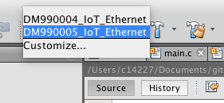
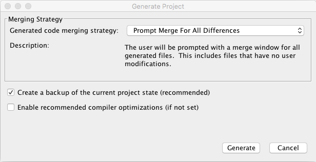

### IoT Ethernet Firmware
#### Compile and Programing

---

### Introduction
This document will show you where to find the latest _released_ version of the firmware source, how to compile it, and then program it into the IoT Ethernet Kit

---

### Required Tools and Applications
#### Microchip Required Tools and Applications
You will need the following Microchip development tools to program and develop with the Microchip IoT Ethernet.

- Download the latest project for IoT Ethernet from here: [IoT Ethernet Project](https://github.com/MicrochipTech/aws-iot-firmware-pic32mz/releases/latest)
- Download and install Microchip MPLAB&reg; Harmony Integrated Software Framework v1.09 for your OS from here: [Harmony](http://www.microchip.com/mplab/mplab-harmony)
- Download and install Microchip MPLAB&reg; X IDE for your OS from here:
[Microchip MPLAB&reg; X IDE](http://www.microchip.com/mplabx) (3.40 Required)
- Download and install the v1.42 XC32 compiler for your OS from here: [Microchip MPLAB&reg; XC32 Compiler](http://www.microchip.com/xc32)

More information about Microchip tools can be found on [Microchip's developer help site](http://microchip.wikidot.com/swtools:start)

---

### Compiling and programming the IoT Ethernet Board
Example below is shown on MAC OS X, these instructions may vary slightly on different OS.

#### Compiling the Firmware
1. Extract the zip file downloaded from the git repository to a location of your choice
- Open MPLAB&reg; X IDE
- Select __File -> Open Project__
- Navigate to: `  <path-to-your-project>/aws-iot-firmware-pic32mz/software/aws-iot-ethernet/firmware`
- Select the project __aws-iot-ethernet.X__
- With your project opened, right click on the project __aws-iot-ethernet__ in the Projects tab and select  __Set as Main Project__
- Select the configuration for the board you wish to program from the dropdown box at the top.

- Follow these directions to install the Microchip Harmony Configurator (MHC):  [Steps to Install MHC](http://ww1.microchip.com/downloads/en/DeviceDoc/MPLAB%20Harmony%20Configurator%20(MHC)%20and%20MPLAB%20Harmony%20Graphics%20Composer.pdf)
- Open the MHC by clicking  __Tools -> Embedded -> MPLAB Harmony Configurator__
- The MHC will prompt asking to choose a Harmony framework to use, select "Yes" and select the location of your Harmony install and click "OK"
- The MHC will then ask if you want to open the configuration file __IoT-Ethernet.mhc__ for the __aws-iot-ethernet__ project, select "Open" to proceed.
- With the new Harmony framework selected for your project, you will need to regenerate code by clicking the generate code button. 
- A settings window will pop up, check only the box "Create a backup...":  
- The MHC merge tool will show differences between code sets.  Ignore the differences and hit "Close" for each file  
- We can now try compiling and programming the code.

#### Programing the IoT Ethernet Board
1. Connect the PICKit&trade; 3 to your computer using the provided USB cable.
- Connect the PICKit&trade; 3 to the IoT Ethernet ICSP 6-pin header.  The pins should match by aligning the triangles.
- Power on the starter kit by connecting a Micro-USB cable to a power source and changing the power switch on the board to USB.
- On the top tab of MPLAB&reg; X, click the __Make and Program Device Main Project__ button.  

  >MPLAB&reg; X may prompt you to select with programmer to use.  Select PICKit&trade; 3 from the prompt and continue.

---

### Troubleshooting
If you are having trouble, check to make sure that each of the issues bellow are resolved.

#### Project won't compile due to missing files
- Often times a project won't compile if you are on a Windows machine due to a limitation in the path length.  Windows OS has a max path length of 260 characters, so file paths are sometimes truncated when attempting to compile which leads to files not being found by the compiler.  Try putting the project in the topmost directory, usually "C:/".  For more information please see [MSDN article from Microsoft](https://msdn.microsoft.com/en-us/library/aa365247%28VS.85%29.aspx#maxpath).
