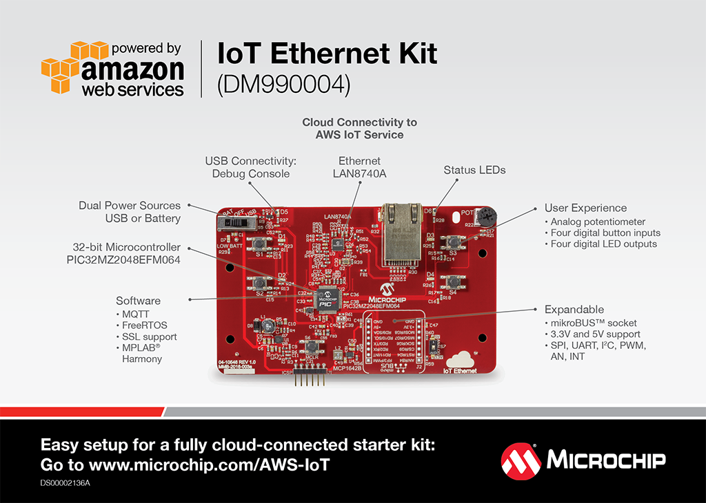

### IoT Ethernet
#### Out of Box Guide

---
### Introduction
[AWS IoT](http://aws.amazon.com/iot/) is a service that will allow internet of things (IoT) devices to be easily and securely connected to Amazon Web Services (AWS).  The IoT Ethernet Kit has been design to work with this service and allow you to develop new IoT based designs.

---
### Required Tools and Applications
#### Microchip Tools and Applications
You will need the following Microchip development tools to run out of box demo

- IoT Ethernet Kit (DM990004), available from [Microchip Direct](http://www.microchipdirect.com/productsearch.aspx?Keywords=DM990004)
- Download and install [Insight on Things](https://github.com/MicrochipTech/aws-iot-insight-on-things-desktop-app) desktop application; [Download latest version](https://github.com/MicrochipTech/aws-iot-insight-on-things-desktop-app/releases/latest)
- To learn more about building the project from source or just upgrading the firmware, read [IoT Ethernet Firmware Compiling and Programing](iot-ethernet-firmware-compile-and-program.md) in our documents folder

---

### Running the Demo
There are two parts to running the demo. First you have to commission the demo so it knows how to talk to your AWS Account. Second is sending and receiving data from AWS IoT.

#### Commissioning
To setup and run the demo follow these instructions:

1. Power the IoT Ethernet Kit by connecting the supplied Micro-USB cable to a computer that will be running the Insight on Things application in the next step and set the power switch on the board to USB.
- Download and install the [Insight on Things](https://github.com/MicrochipTech/aws-iot-insight-on-things-desktop-app) application v2.0.0 or greater.
- Follow the instructions for running the Insight on Things application.
- You will see a LEDs D1-D6 light up while the board gets initial data from the server.
    - If not, please see the [Status and Error Code Table](Status and Error Code Table) table below for more information.
- The board is now connect and running; there are two blue LED status indicator on the board.
    - LED D6 will flash briefly when transmitting data.
    - LED D5 will flash briefly when receiving data.

#### Sending and Receiving Data with AWS IoT
This demo is controlled though the AWS IoT shadow registers by the [Insight on Things](https://github.com/MicrochipTech/aws-iot-insight-on-things-desktop-app) desktop application that we provide you.  [Click here download the latest version](https://github.com/MicrochipTech/aws-iot-insight-on-things-desktop-app/releases/latest).  You will need to follow the README.md guide on the github page to setup this application.

---

### Troubleshooting
If you are having trouble connecting with the starter kit, check to make sure that each of the issues bellow are resolved.

#### Connection Issue
- Check that you have a valid internet connection on your network.
- Ensure that port 8883 is open to the internet.
- Ensure that your AWS IoT service is setup property.

#### Change the configuration
- Changing the configuration that you entered, or if you entered it incorrectly, simply power off the starter kit, press and hold S2 and S3 while turning on the power to the starter kit.
- This will erase the current configuration and you can begin this process again and re-enter the configuration information.

#### Association to AP Failed
- Check that your access point is not blocking MAC addresses.

#### DNS Resolved Failed
- Check that the AWS IoT Endpoint Address you configured your starter kit with is correct.
- Check that you have a valid internet connection on your network

#### Status and Error Code Table
 D7  | D6  | D5  | D4  | D3  | D2  | D1  | Diagnostic Report
:---:|:---:|:---:|:---:|:---:|:---:|:---:|-----
 -   | 0   | F   | 0   | 0   | 0   | 0   | Configuration Mode: Need to configure Connected to network
 -   | 1   | 1   | 1   | 1   | 1   | 1   | Connected to network and waiting on data
 -   | 1   | 0   | C   | C   | C   | C   | Associating to network
 -   | 1   | 1   | 0   | 0   | 0   | 1   | Connection Issue, no internet found
 -   | 1   | 1   | 0   | 0   | 1   | 0   | Association to network failed
 -   | 1   | 1   | 0   | 1   | 0   | 1   | DNS Unresolved: Bad endpoint or no connection
 -   | F   | 0   | -   | -   | -   | -   | Normal Operation: D6 flashes each message transmission
 -   | 0   | F   | -   | -   | -   | -   | Normal Operation: D5 flashes each subscription receive
 1   | -   | -   | -   | -   | -   | -   | Battery Voltage Low
F = Flashing, C = Rotating in a counter clockwise pattern, - = Don’t care, 0 = Off, and 1 = On
